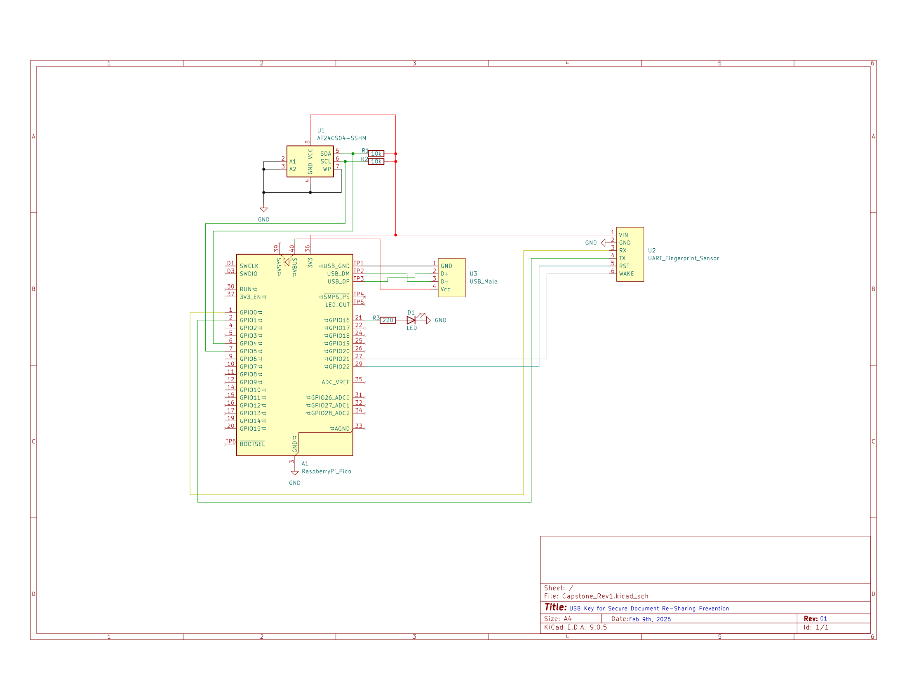

# USB Key Project (ELEC 498)

## Initial Setup (Production/Manufacturing)

### Wiring
A wiring diagram for this project is available in `Schematic.pdf`.



### Push Firmware to USB Key
1. Install necessary firmwares and libraries by following the instructions in `firmware/README.md`
1. Upload all of the `.py` files in the `firmware` directory to the USB key's root file directory
1. Disconnect the USB key

### Generate RSA Key Pair and Push Private Key to USB Key
1. First generate the key by running `setup/generate_keys.py`
1. Once you have your key, go and paste it in the `KEY_BODY` variable, make sure it is all one line
1. Connect your USB and run `setup/write_key.py` in Thonny
1. Your private key is now saved to the usb key
1. *TODO:* Write what to do with the public key here

## How to Run It (User)

### Configure Port Forwarding (Windows & WSL2)
1. Powershell: `winget install usbipd-win`
1. Close that Powershell terminal and open a new one (as admin)
1. Do `usbipd list` in Powershell with the device disconnected
1. Plug the device into the USB port you plan to use it with and do `usbipd list` again, seeing which entry is there now that wasn't before. Take note of its BUSID (e.g., "1-2")
1. In Powershell, do `usbipd bind --force --busid <YOUR BUSID>`, then do `usbipd attach --wsl --busid <YOUR BUSID> --auto-attach` and leave that Powershell terminal running
1. Unplug the USB key again
1. When done running the program (from another terminal following later steps), kill the Powershell process and then do `usbipd unbind --busid <YOUR BUSID>` (in Powershell)

If working directly on a Linux machine, this step is not necessary. If using a virtual machine on either Windows or Mac, the instructions to emulate it will be specific to the VM software you're using. 

Note that a final version of this product would not require this step, instead shipping OS-specific executables (instead of source code) that can easily interact directly with hardware.

### Alternate Discovery Mode
For debugging purposes, we can force the port used to talk to the device to be the most common one on VMs. To do this, uncomment the following line in `hardware_communication/hw_comms.hpp`.

```c++
#define DEBUG_SIMPLE_DISCOVERY_MODE // Uncomment this to use simplified discovery for VM work
```

### Compile and Run Client-Side Program
1. Install Docker engine. If you're using Ubuntu on WSL2, you can do so by following [these instructions](https://docs.docker.com/engine/install/ubuntu/)
1. Build the Docker image via `docker compose build`
1. Run the application via `docker compose run --rm app`

## What Each File Does
Here is a quick explanation of the files so you know where everything is:

  1. `main/main.py`:
  This is the main application file. It handles the "Handshake" and shows the menu loop (Press 1 for Status, Press 2 for Enroll, etc.).

  1. `main/communication.py`:
  This file handles all the ZMQ socket stuff. It sends JSON commands and waits for answers.
  It also runs a Watchdog in the background. This is a separate thread that keeps checking if the device is plugged in. If the device disappears, it deletes the decrypted files.

  1. `main/files.py`:
  This file is supposed to handle reading, encrypting, and decrypting files. \

  1. `build/Dockerfile`:
  Encapsulates the application.

  1. `docker-compose.yml`:
  Used to run the dockerfile. The network_mode: "host" so the code inside the container can talk to the device

  1. `build/requirements.txt`:
  This is just a list of libraries required, currently only installs pyzmq

## Encryption/Decryption Info
1. When encrypting a file, be sure that it is in the root directory of the USB-Key-Application folder
1. When decrypting a file the decrypted file will appear in the root directory of the USB-Key-Application folder
1. Right now after decrypting is done, the app gets stuck in a loop of printing [SECURITY ALERT] DEVICE DISCONNECTED DELETING FILES. Dont worry its not actually deleting the decrypted file, its just a bug I need to fix. But to exit the app from this stage, just hit enter for the main menu to reappear, enter 6, and then hit enter once again